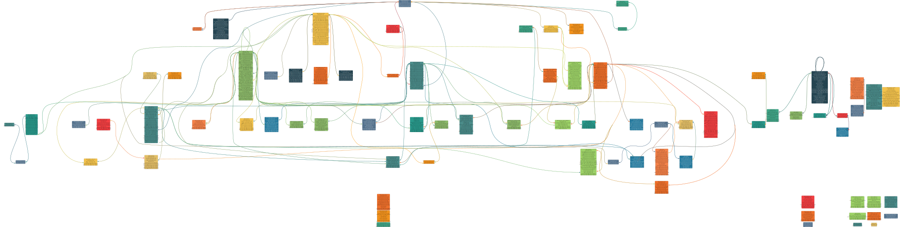

# Python Postgres ERD Generator

Generates Entity Relationship Diagrams (ERDs) using Graphviz from PostgreSQL schema dump files or live database connections.

## Features

**Core Functionality:**
- Parse PostgreSQL schema dump files to extract table definitions and relationships
- Connect directly to PostgreSQL databases for real-time schema visualization
- Generate interactive SVG Entity Relationship Diagrams
- Automatic color coding for tables with accessible color palette
- Support for complex SQL structures including foreign keys, constraints, and various data types
- Table filtering to exclude temporary/utility tables
- Comprehensive test suite with >95% code coverage

**Interactive Features:**
- **Smart Initial View** - Automatically selects and zooms to the table with the most connections
- **Double-Click Navigation** - Double-click any table to center on it and all its connected relationships
- **Real-Time Graphviz Settings** - Modify layout parameters and regenerate diagrams in-browser
- **Database Server Integration** - Query, browse, and switch between databases with `--view` mode
- **Focused ERD Generation** - Select specific tables to create simplified sub-diagrams
- **Print-Friendly Export** - Generate clean diagrams for documentation
- **Interactive Panels** - Movable, resizable metadata, miniature overview, and selection panels
- **MouseOver Information** - Extra details on paths and entities
- **Miniature Navigator** - Viewport indicator with 10% scaled overview showing current view area

## TODO:
- Create animated GIF demonstrations of interactive features
- Update tests to run remotely properly


## Installation

1. Install pypgsvg:

```bash
pip install .
```

2. Ensure Graphviz is installed on your system:
   - **macOS**: `brew install graphviz`
   - **Ubuntu/Debian**: `sudo apt-get install graphviz`
   - **Windows**: Download from <https://graphviz.org/download/>

## Usage

### Basic Usage

Generate an ERD from your SQL dump file:

```bash
# From a schema dump file
pg_dump -h 192.168.1.xxx --format=plain -d universe_db -U postgres -s -O -F plain --disable-triggers --encoding=UTF8 -f schema.dump
pypgsvg schema.dump

# Or connect directly to a live database
pypgsvg --host localhost --port 5432 --database mydb --user postgres --view
```

This will create an SVG file with interactive features including smart zoom, double-click navigation, and real-time Graphviz settings modification.

### Example Output

Here are examples of generated ERDs from different database schemas:

 

*Left: Simple blog schema (users, posts, comments) | Right: Complex schema with 90+ tables*

*Note: The tool generates SVG files, but PNG is shown for the simple example for better README compatibility. You can [view the original SVG files](sample_schema_erd.svg) for interactive features.*

The diagrams show:

- **Tables** as nodes with their column definitions
- **Foreign key relationships** as directed edges between tables
- **Automatic color coding** for visual distinction
- **Accessible color palette** with proper contrast for readability
- **Scalability** from simple 3-table schemas to complex 90+ table enterprise databases

The simple example demonstrates a typical blog schema where:

- Users can create multiple posts
- Posts can have multiple comments
- Comments belong to both a post and a user

### Advanced Usage

Specify a custom output filename:

```bash
pypgsvg schema.dump --output custom_diagram

# Or with database connection
pypgsvg --host prod-db.company.com --port 5432 --database analytics --user readonly --output analytics_erd
```

View the diagram immediately after generation with full interactive features:

```bash
pypgsvg schema.dump --view

# With database connection for browsing and switching databases
pypgsvg --host localhost --database mydb --user postgres --view
```

The `--view` mode enables:
- Smart initial zoom to most connected table
- Double-click navigation between tables
- Real-time Graphviz settings modification
- Database querying and switching
- Focused ERD generation from selections
- Print-friendly export

### Python API Usage

For programmatic use:

```python
from src.create_graph import parse_sql_dump, generate_erd_with_graphviz

# Load SQL dump
with open("schema.dump", "r", encoding='utf-8') as file:
    sql_content = file.read()

# Parse tables and relationships
tables, foreign_keys, errors = parse_sql_dump(sql_content)

# Generate ERD
if not errors:
    generate_erd_with_graphviz(tables, foreign_keys, "database_diagram")
    print("ERD generated successfully!")
else:
    print("Parsing errors found:", errors)
```

## Testing

Run the complete test suite with coverage:

```bash
# Run all tests with coverage
pytest

# Run specific test categories
pytest -m unit          # Unit tests only
pytest -m integration   # Integration tests only

# Run with verbose output
pytest -v

# Generate HTML coverage report
pytest --cov-report=html
open htmlcov/index.html  # View coverage report
```

## Project Structure

```text
├── src/
│   └── create_graph.py          # Main application code
├── tests/
│   ├── conftest.py              # Test fixtures and configuration
│   ├── test_utils.py            # Tests for utility functions
│   ├── test_parser.py           # Tests for SQL parsing
│   ├── test_erd_generation.py   # Tests for ERD generation
│   └── test_integration.py      # Integration tests
├── requirements.txt             # Python dependencies
├── pyproject.toml              # pytest configuration
└── README.md                   # This file
```

## Configuration

### Table Exclusion

The application automatically excludes tables matching certain patterns (defined in `should_exclude_table`):

- Views (`vw_`)
- Backup tables (`bk`)
- Temporary fix tables (`fix`)
- Duplicate tables (`dups`, `duplicates`)
- Match tables (`matches`)
- Version logs (`versionlog`)
- Old tables (`old`)
- Member data (`memberdata`)

### Color Palette

The ERD uses an accessible color palette with automatic contrast calculation for text readability following WCAG guidelines.

## Supported SQL Features

- `CREATE TABLE` statements with various column types
- `CREATE TABLE IF NOT EXISTS`
- `ALTER TABLE ... ADD CONSTRAINT ... FOREIGN KEY`
- Quoted identifiers
- Complex data types (numeric, timestamp, jsonb, etc.)
- Multiple constraint variations

## Error Handling

The application includes comprehensive error handling for:

- Malformed SQL syntax
- Missing table references in foreign keys
- Unicode encoding issues
- File reading errors

## Contributing

1. Follow PEP 8 style guidelines
2. Write tests for new functionality
3. Maintain >90% test coverage
4. Use type hints where appropriate
5. Update documentation as needed

## Dependencies

- `graphviz>=0.20.1` - For generating diagrams
- `pytest>=7.4.0` - Testing framework
- `pytest-cov>=4.1.0` - Coverage reporting
- `pytest-mock>=3.11.0` - Mocking utilities
